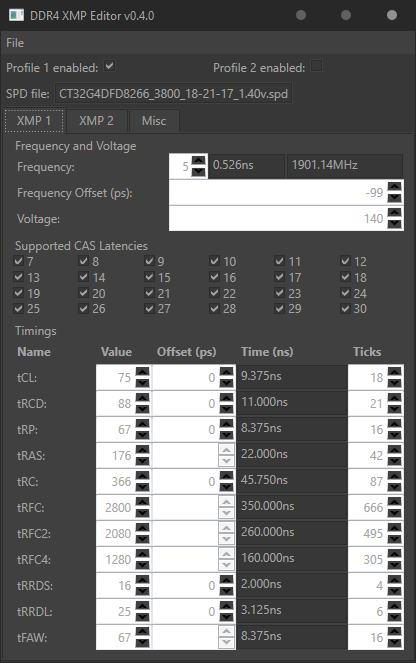

# DDR4 XMP Editor
Editor for DDR4 SPD and XMP

# Usage (on Ryzen)
1. Dump the SPD using [spd_check](https://cdn.discordapp.com/attachments/727089095570096211/788561019517272124/spd_check_v02_test2.zip).
2. Open SPD dump and change settings to whatever you want.
3. Save your modified SPD.
4. Write the modified SPD using spd_write.
